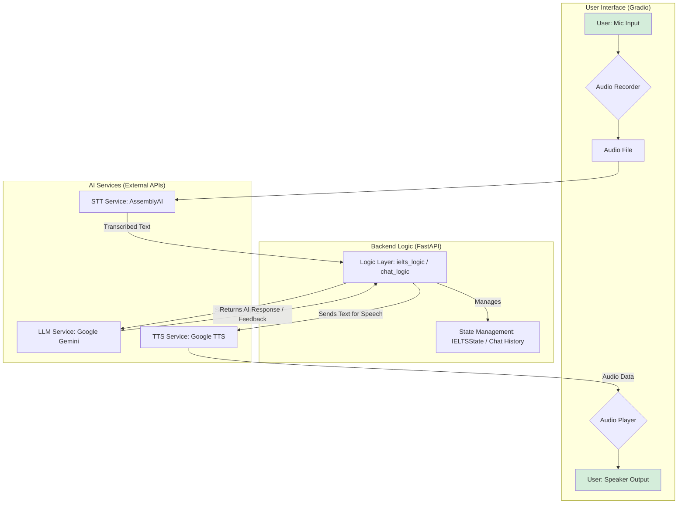

# Aurora: An AI-Powered English Speaking Coach

> An AI-powered application designed to help non-native speakers improve their English proficiency through a dual-mode system of structured IELTS simulation and open-ended conversational practice.

---

<!-- 
**ACTION REQUIRED:** Add a high-quality GIF or a few screenshots of your application here. This is the most important part of the README for grabbing a visitor's attention.
- A shot of the IELTS mode with a question and feedback buttons.
- A shot of a generated final report.
- A shot of the Free Chat mode.
-->
<!--  -->

---

## About The Project

Many language learners struggle to find safe, interactive environments to practice their speaking skills. Aurora is an AI-powered English-speaking assistant designed to solve this problem.

It uniquely combines two essential training methods:

*   An **IELTS Speaking simulator** that provides detailed, criteria-based feedback and estimated scores to help users prepare for exams.
*   An **open-ended Conversation mode** where users can practice natural, spontaneous conversation with an AI partner.

By offering both structured practice and conversational freedom, Aurora provides a complete solution for building real-world speaking confidence.

---

## Key Features

### IELTS Speaking Simulator (Standard Practice)

*   **Complete 3-Part Simulation:** Faithfully replicates the full IELTS test structure, from the initial interview to the final in-depth discussion.
*   **Dynamic AI Feedback:** Receive detailed, qualitative feedback after each part, or a comprehensive, scored report that analyzes your entire performance across all three parts.
*   **Criteria-Based Scoring:** Get an estimated band score for Fluency, Lexical Resource, and Grammar, with every score justified by specific examples from your own answers.

### Conversational Fluency Coach (Natural Practice)

*   **Real-Time Conversational Loop:** Practice speaking naturally in a low-pressure environment with an AI partner that listens, understands, and responds in voice.
*   **(In Development) Advanced Audio Analysis:** The next generation of Aurora will move beyond text analysis to provide feedback on *how* you speak, including:
    *   **Phonetic Accuracy:** Pinpointing specific pronunciation errors at the sound level.
    *   **Fluency Metrics:** Analyzing speech rate, filler words (`um`, `ah`), and pause duration to help you sound more natural.

---

## Architecture & Tech Stack

Aurora is built on a modern, modular Python backend with a reactive web interface. The architecture is designed to be extensible, allowing for the easy addition of new services and practice modes.

### Architecture Diagram



### Technologies Used

**Backend**
*   **[FastAPI](https://fastapi.tiangolo.com/):** Chosen for its high performance, asynchronous capabilities, and automatic API documentation.
*   **[Uvicorn](https://www.uvicorn.org/):** Serves as the lightning-fast ASGI server for FastAPI.

**Frontend**
*   **[Gradio](https://www.gradio.app/):** Used for its ability to rapidly create and deploy interactive machine learning web apps. It is mounted directly onto the FastAPI backend.

**Core AI Services**
*   **Language Model (LLM):** **[Google Gemini 1.5 Pro](https://ai.google.dev/)** is used for all conversational logic and for generating both the qualitative part-by-part feedback and the final comprehensive, scored report.
*   **Speech-to-Text (STT):** **[AssemblyAI](https://www.assemblyai.com/)** provides fast and accurate transcription of the user's spoken answers.
*   **Text-to-Speech (TTS):** **[Google Cloud TTS](https://cloud.google.com/text-to-speech)** is used to generate natural-sounding voice responses for the AI in Free Chat mode.

**Data & State Management**
*   **[Pydantic](https://docs.pydantic.dev/):** Crucial for ensuring robust data validation. It parses the JSON responses from the LLM into reliable Python objects, preventing data-related errors.
*   **Stateful Dataclasses:** The application state for the IELTS test is managed in a structured Python `@dataclass`, ensuring type safety and clarity.

---

## Getting Started

To get a local copy up and running, follow these simple steps.

### Prerequisites

*   Python 3.9+
*   An API key from [AssemblyAI](https://www.assemblyai.com/)
*   An API key from [Google AI Studio](https://ai.google.dev/) for Gemini
*   A Google Cloud service account key with the Text-to-Speech API enabled.

### Installation

1.  **Clone the repository:**
    ```sh
    git clone https://github.com/altafuddin/aurora.git
    cd aurora
    ```

2.  **Create and activate a virtual environment:**
    ```sh
    python -m venv venv
    source venv/bin/activate  # On Windows use `venv\Scripts\activate`
    ```

3.  **Install the required packages:**
    ```sh
    pip install -r requirements.txt
    ```

4.  **Set up your environment variables:**
    *   Create a file named `.env` in the root of the project by copying the example file:
        ```sh
        cp .env.example .env
        ```
    *   Open the `.env` file and add your API keys:
        ```env
        ASSEMBLYAI_API_KEY="your_assemblyai_key_here"
        GEMINI_API_KEY="your_gemini_key_here"
        # The path to your Google Cloud credentials JSON file
        GOOGLE_APPLICATION_CREDENTIALS="path/to/your/gcp-credentials.json"
        ```

5.  **Run the application:**
    ```sh
    uvicorn main:app --reload
    ```
    The application will be available at `http://127.0.0.1:8000`.

---

## Roadmap

This project is under active development. Future enhancements include:

*   **[ ] Advanced Audio Analysis:**
    *   Implement phonetic-level pronunciation assessment.
    *   Analyze fluency metrics like speech rate, pause duration, and filler word count.

*   **[ ] User Accounts & Progress Tracking:** Allow users to track their performance and improvement over time.

---

## License

Distributed under the MIT License. See `LICENSE` for more information.

---

## Contact

Altaf Uddin - [LinkedIn](https://www.linkedin.com/in/altaf-uddin-b443331ab/)

Project Link: [https://github.com/altafuddin/aurora](https://github.com/altafuddin/aurora)